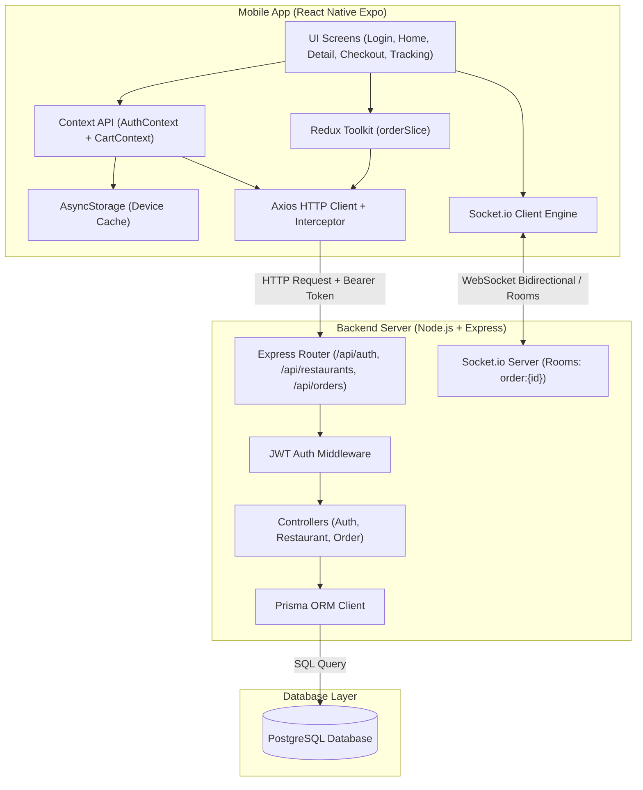
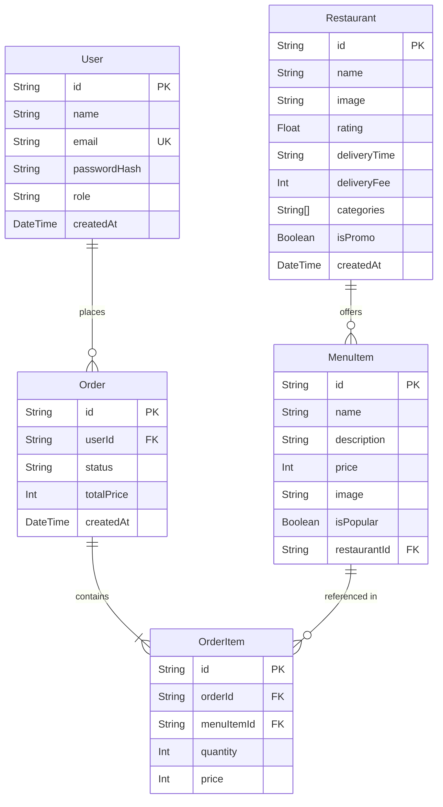

# 🏛️ 01. Arsitektur & Overview Aplikasi

Dokumen ini menjelaskan rancangan arsitektur sistem, pembagian lapisan (layering), teknologi pendukung, dan skema basis data yang digunakan pada aplikasi GoFood Clone.

---

## 1. Arsitektur Tingkat Tinggi (High-Level Architecture)

Aplikasi dibangun menggunakan pola arsitektur **Client-Server Terdistribusi** yang memisahkan antara frontend aplikasi mobile dengan backend API & Real-time engine.

---

## 2. Peta Teknologi (Technology Stack)

### **A. Backend**
| Teknologi | Kegunaan |
|---|---|
| **Node.js + Express** | Web framework untuk menangani routing REST API dan middleware |
| **TypeScript** | Static typing untuk menjamin keandalan kode dan mencegah runtime errors |
| **Prisma ORM** | Object-Relational Mapper untuk berinteraksi dengan database PostgreSQL secara type-safe |
| **PostgreSQL** | Database relasional penyimpanan User, Restaurant, MenuItem, Order, dan OrderItem |
| **Bcryptjs** | Library hashing kata sandi satu arah dengan salt untuk keamanan akun |
| **JSON Web Token (JWT)** | Token stateless berbasis klaim untuk proses otentikasi & otorisasi request |
| **Socket.io** | Engine komunikasi real-time berbasis WebSocket dengan fitur *Rooms* dan *Auto-fallback* |

### **B. Mobile**
| Teknologi | Kegunaan |
|---|---|
| **React Native (Expo SDK 57)** | Framework cross-platform untuk menghasilkan aplikasi mobile iOS & Android |
| **TypeScript** | Menjamin tipe data state, response API, dan props komponen |
| **React Navigation (Native Stack)** | Manajemen navigasi halaman (screen transitions, auth guard stack) |
| **Context API** | Manajemen state lokal/sederhana (Keranjang belanja & Sesi Auth) |
| **AsyncStorage** | Penyimpanan token JWT dan profil pengguna secara permanen di storage perangkat |
| **Redux Toolkit (@reduxjs/toolkit)** | Manajemen state global terstruktur untuk alur kompleks (Order & Checkout lifecycle) |
| **Axios** | HTTP client untuk request API dengan konfigurasi interceptor otomatis |
| **Socket.io-Client** | Client socket untuk menerima dan mengirimkan pembaruan koordinat driver |

---

## 3. Skema Basis Data (Database ERD)

Database dirancang dengan relasi antar entitas yang ketat dan efisien:

### Penjelasan Relasi:
1. **User ke Order (1 to N)**: Satu user dapat memiliki banyak order riwayat pemesanan (`User.orders`).
2. **Restaurant ke MenuItem (1 to N)**: Satu restoran memiliki banyak daftar makanan & minuman (`Restaurant.menuItems`).
3. **Order ke OrderItem (1 to N)**: Satu transaksi order memuat satu atau lebih rincian item belanja (`Order.items`).
4. **MenuItem ke OrderItem (1 to N)**: Satu menu item dapat dibeli dalam berbagai pesanan yang berbeda.
