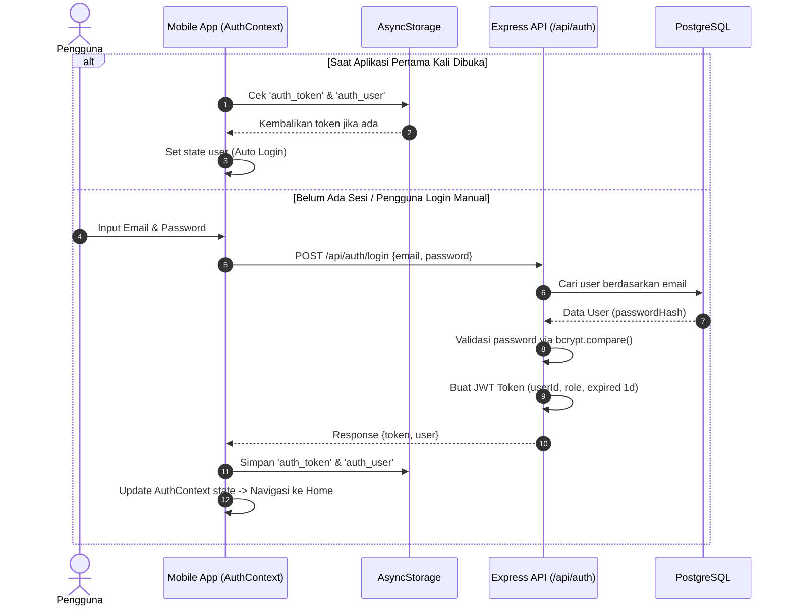
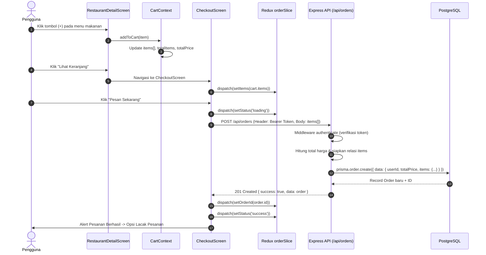
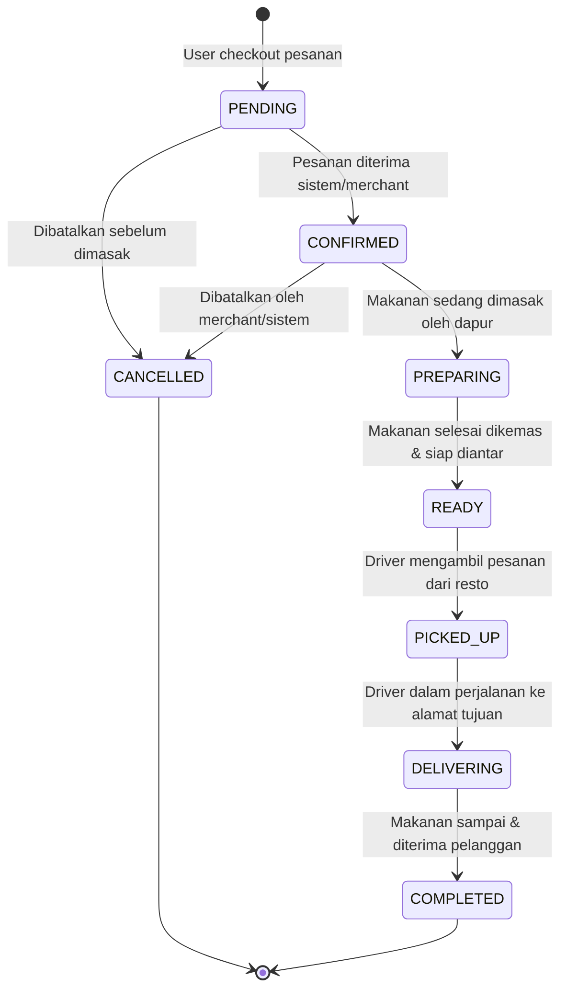
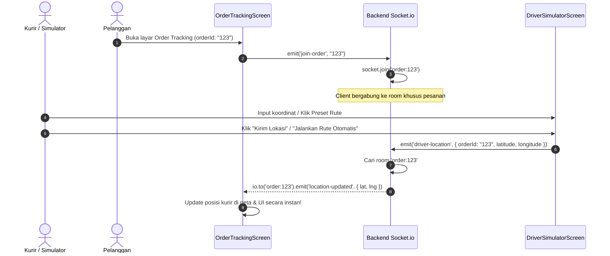

# 🔄 02. Alur & Flow Aplikasi (End-to-End)

Dokumen ini menjelaskan alur bisnis dan teknis dari saat pengguna membuka aplikasi hingga pesanan diantar oleh kurir secara *real-time*.

---

## 1. Alur Autentikasi & Manajemen Sesi (JWT + AsyncStorage)

---

## 2. Alur Pemesanan (Cart -> Redux -> Checkout -> Order API)

Strategi state management memisahkan keranjang belanja lokal dengan alur transaksi pemesanan:
- **`CartContext`**: Mengelola item yang ditambah/dikurangi di layar restoran.
- **`Redux orderSlice`**: Mengatur status checkout (`idle` ➔ `loading` ➔ `success` / `failed`) serta menyimpan `orderId` yang dihasilkan.

---

## 3. Siklus Hidup Status Pesanan (Order Lifecycle)

Setiap pesanan di sistem mengikuti alur status yang terdefinisi dengan jelas:

---

## 4. Alur Pelacakan Real-time (Socket.io Rooms & Driver Simulation)

Tanpa WebSocket, aplikasi harus melakukan polling API terus menerus (boros bandwidth dan baterai). Dengan **Socket.io Rooms**, update lokasi kurir hanya dikirimkan ke pelanggan yang memesan pesanan tersebut.

### Keunggulan Desain Ini:
1. **Targeted Delivery**: Koordinat driver pesanan A tidak akan bocor ke pelanggan pesanan B karena dipisahkan oleh *Room Key* (`order:${orderId}`).
2. **Instant Feedback**: Pelanggan melihat motor driver bergerak tanpa jeda polling.
3. **Resilient**: Jika koneksi terputus sesaat, Socket.io secara otomatis menyambung kembali (*auto-reconnect*).
