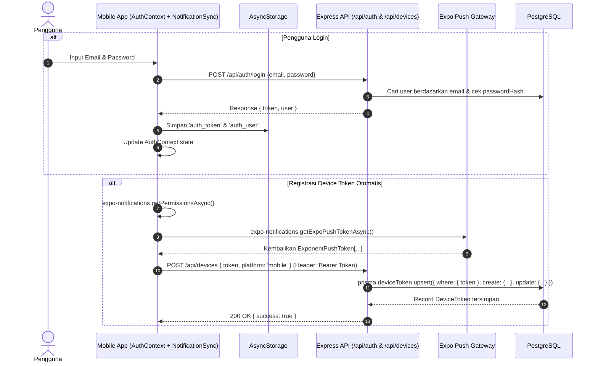
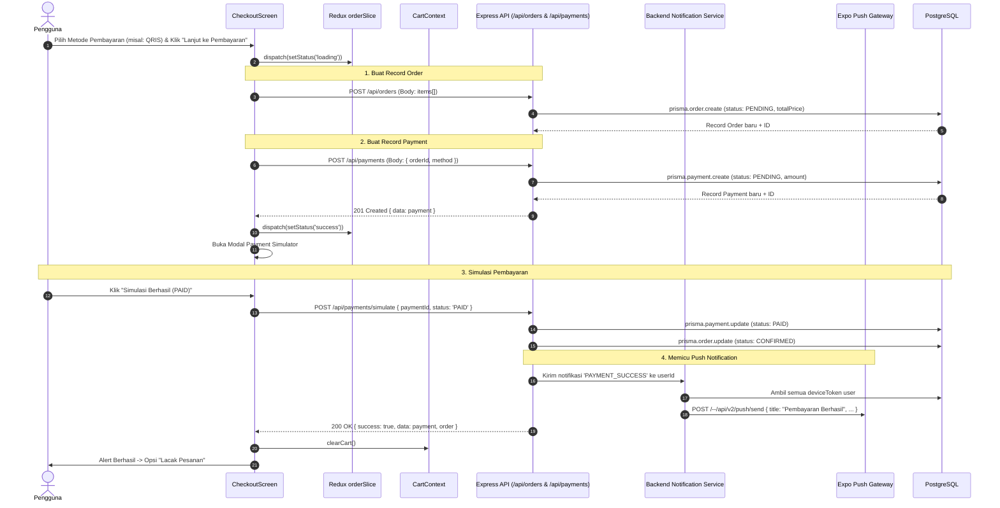
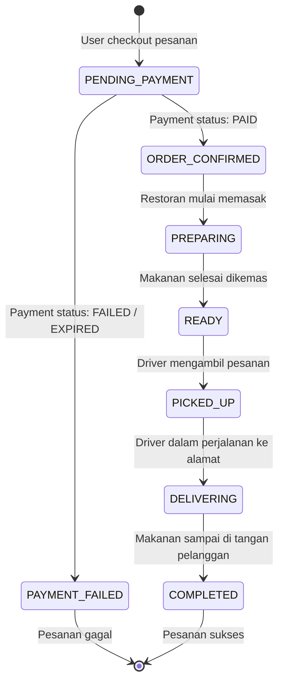
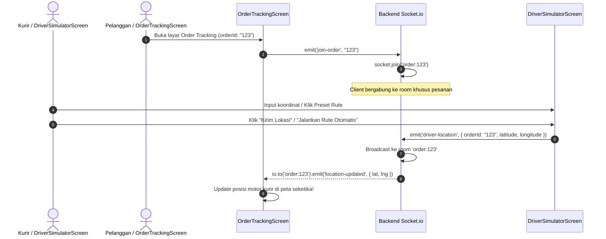
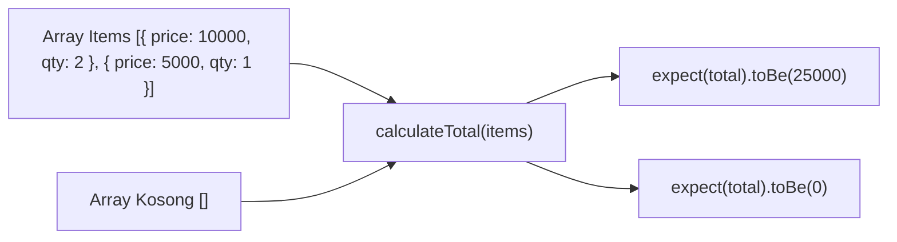

# 🔄 02. Alur & Flow Aplikasi (End-to-End)

Dokumen ini menjelaskan alur bisnis dan teknis dari saat pengguna membuka aplikasi, memilih makanan, melakukan pembayaran lewat simulator, menerima notifikasi push, hingga pesanan diantar oleh kurir secara *real-time*.

---

## 1. Alur Autentikasi & Registrasi Device Token (JWT + Push Notification)

---

## 2. Alur Pemesanan & Pembayaran (Checkout -> Payment Simulator)

Strategi state management memisahkan keranjang belanja lokal dengan alur transaksi pemesanan dan pembayaran:
- **`CartContext`**: Mengelola item yang ditambah/dikurangi di layar restoran dan menyediakan fungsi `clearCart()`.
- **`Redux orderSlice`**: Mengatur status checkout (`idle` ➔ `loading` ➔ `success` / `failed`) serta menyimpan `orderId` yang dihasilkan.
- **`Payment Simulator`**: Mensimulasikan hasil pembayaran (`PAID` atau `FAILED`) secara instan tanpa gateway eksternal sungguhan.

---

## 3. Siklus Hidup Status Pesanan & Pembayaran (State Machine)

Setiap pesanan di sistem mengikuti alur status yang saling terhubung dengan status pembayaran:

---

## 4. Alur Pelacakan Real-time (Socket.io Rooms & Driver Simulation)

Dengan **Socket.io Rooms**, update lokasi kurir hanya dikirimkan ke pelanggan yang memesan pesanan terkait secara *targeted* tanpa polling API:

---

## 5. Alur Unit Testing (Quality Assurance)

Untuk memastikan keandalan kalkulasi transaksi sebelum kode dirilis ke tahap produksi:

- Menjamin tidak ada *regression error* saat dilakukan perubahan struktur kode.
- Dapat diuji secara otomatis di terminal atau CI/CD pipeline menggunakan perintah `npm test`.
